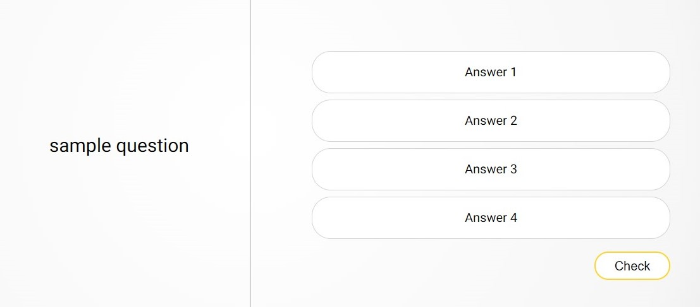
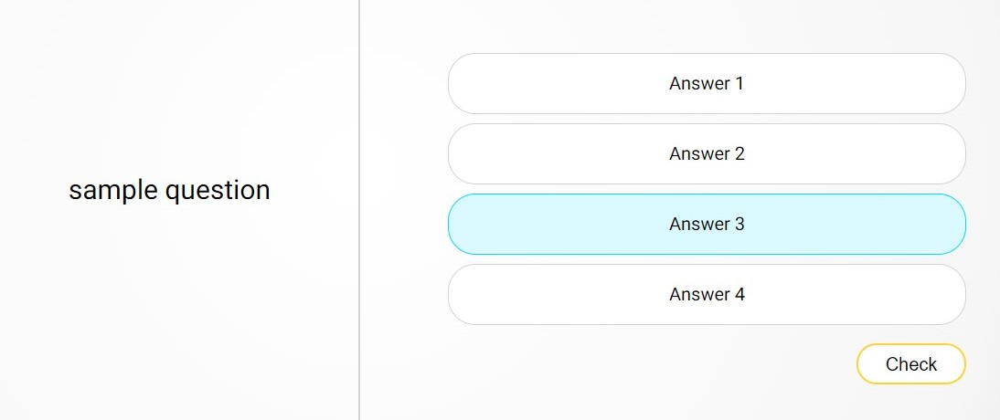
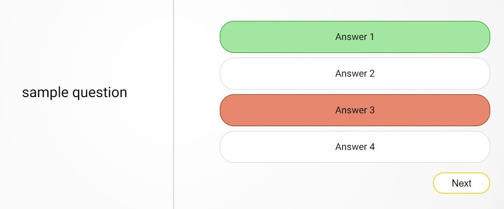
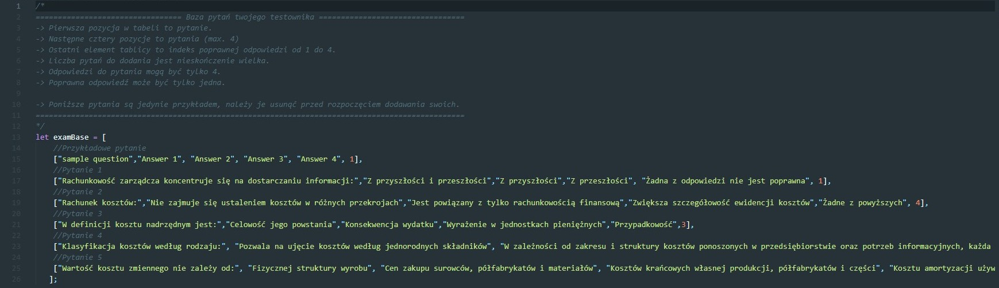

# Testownik
## General info
This is a project that should help you to learn for the exam by learning questions from previous years. All you need is to add all questions that you have to a file named "questions.js". After this you can start learning. Yes, it is that simple!

## How to Use

Programme displays random question with 4 answers to it.

All you have to do is choose one of four displayed answers. After choosing answer you need to check it by button below answers.

After checking you will see which answer was correct. If your answer was wrong it will become red.

## How to add questions
Open file "questions.js" with notepad or other software.

Delete all sample questions.
Now you can add your questions by following schema:
[0, 1, 2, 3, 4, 5],
- 0 <- Question
- 1 <- Answer 1
- 2 <- Answer 2
- 3 <- Answer 3
- 4 <- Answer 4
- 5 <- Index of correct answer (1-4)

f.e.: ["solve the equation: 2+2*2=", "4", "8", "6", "other", 3],
##### remember to add comma between questions.
#### You should not make changes in other files than "questions.js" because it may cause problems in programme working.
## Technologies
* HTML 5
* CSS 3
* JavaScript 
* jQuery 3.5.1
* ## Version
* 1.0 
